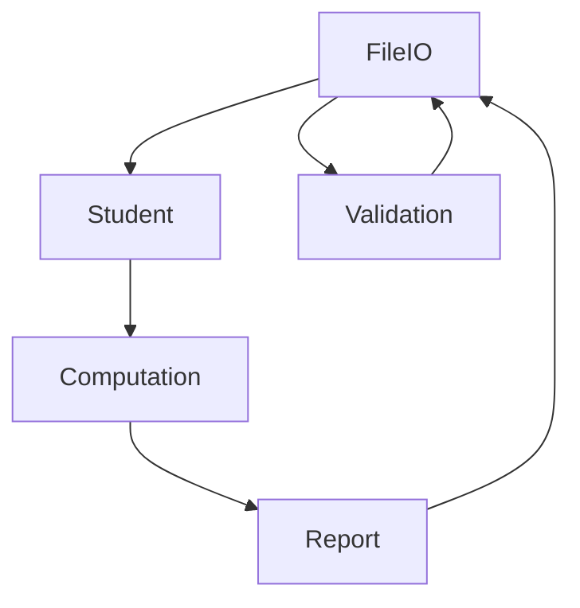

# Lab2: Student Result Processing System

### Description:
This program is designed to manage and add students and process their results to check total, grade, and CGPA with a friendly user experience and simple structure.

### Modules:
#### 1. Student:
The main module and dependency that has the typedef and structure to store student data and should have the create, update, remove, and other operations. For now just addition.

#### 2. Computation:
This contain functions to calculate Total, Grade, and CGPA.

#### 3. Report:
This module contain functions to display a report about the marks and some statistics.

#### 4. Validation:
All validation functions to check user input and validate it.

#### 5. FileIO:
All user input functions and whenever an input or output from user or file is required.

#### 6. Utils:
Extra functions that doesn't belong to any of the previous.

### Module Dependency Diagram (Has no meaning, just to show a diagram):

There was no enough time to make all changes, I will try better next time
